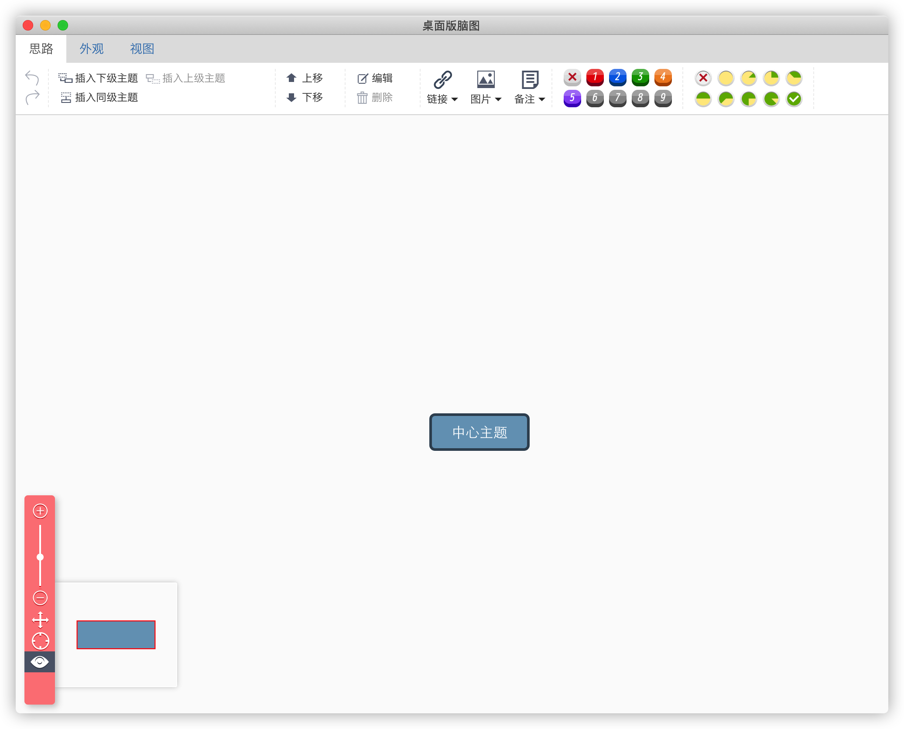

# 被收费绘图工具 PUA 了怎么办？来看看这个老实工具吧

> 本文非常适合 Electron 入门选手，墙裂推荐！


<p align="center">本文作者：HelloGitHub-<strong>蔡文心</strong></p>

大家好！这里是 HelloGitHub 推出的[《讲解开源项目》](https://github.com/HelloGitHub-Team/Article)系列，今天给大家带来的一款基于 Electron 和 PHP 实现的**桌面工具**开源项目——**DesktopNaotu**（桌面版脑图）。

不知道各位小伙伴有没有发现，现在许多工作岗位与图表制作的接触越来越多，时不时给你来个需求。市面上的多数图表制作软件要么收费，要么让充 VIP 。充个月卡，很有可能只用了1次。这两件事加在一起就像渣 * 一边 PUA 你，一边还骗你钱！

如果你身边有这样的朋友，请介绍给我 ，我来负责

如果你没有，那你现在有了，因为很不幸我就是被 PUA 的一个


好产品收费当然无可厚非，不过你可是 HG 的读者，而我们 HG 的背后是开源世界！DesktopNaotu 是一个开源项目，它也是一个完全免费的脑图制作工具。

## 一、介绍

DesktopNaotu 是基于百度脑图的本地化版本，能够帮助你在没有互联网环境的情况下，依然可以使用脑图工具。

> 官网：https://inaotu.org/

### 1.1 跨平台

DesktopNaotu 目前支持 MacOS 、Linux 和 Windows 7/10

### 1.2 功能

- 包含百度脑图的基本功能
- 支持本地 .km文件的操作
- 支持拖拽打开 .km文件
- 支持关联打开 .km文件
- 支持自动保存文件功能
- 支持导出多种格式文件
- 提供 **百度脑图** 文件的下载方式：https://github.com/NaoTu/DesktopNaotu/blob/master/doc/Help.md
- 提供 **ProcessOn** 思维导图的下载方式

## 二、安装

### 2.1 下载安装包

- 百度云 https://pan.baidu.com/s/1jHNBL7C
- Github https://github.com/NaoTu/DesktopNaotu/releases

### 2.2 解压

将DesktopNaotu-darwin-x64文件夹解压至应用程序目录

### 2.3 启动

好了，到这一步软件已经能够启动了，但是大家可能注意到了菜单怎么是英文的呢，官网示例明明是中文的呀。没错这里的确是有个bug，不过文心已经找到了解决方案，请看下一步


### 2.4 解决语言问题

目前文心测试了 win10 和 mac 两个较为常用的平台，发现在 win10 下安装后能够显示中文语言。所以如果是 win10 用户就可以跳过这块内容了。

像文心一样想要使用中文菜单的 mac 用户请放心，文心已将帮你们倘过这个坑了。


#### 2.4.1 语言设置

在终端输入以下命令

```shell
 cd '~/Library/Application Support/desktopnaotu'
 vi naotu.config.json
```

接下来会看到以下信息，将其中的 locale: en 改为 locale: zh_CN

```json
{"locale":"en","defSavePath":"/Users/caim014/Library/Application Support/desktopnaotu/backup","isAutoSave":true,"recentMaxNum":5,"recently":[{"time":"2021-01-21 18:07:58","path":"/Users/caim014/Library/Application Support/desktopnaotu/backup/Main Topic1.km"},{"time":"2021-01-20 15:57:05","path":"/Users/caim014/Library/Application Support/desktopnaotu/backup/Main Topic.km"}],"version":"v0.1"}
```

最后 esc 并输入以下内容后回车

```shell
:wq
```

重启 Desktopnaotu 程序就能看到效果了



好啦，到这为止你就可以正常使用 Desktopnaotu 来绘制脑图了。

## 三、技术栈

### 3.1 前端

- Electron ：使用了 Electron 实现跨平台应用开发
- Typescript

### 3.2 后端

- PHP

## 四、最后

在今天的文章中比较有意思的是设置语言问题，由于官方也没有针对这个问题做解释，加上之前我也没有接触过 Electron 框架，对桌面程序的配置文件也没有太多了解。为了解决语言设置问题，也是费了很大一番功夫，当然也可能是我比较菜: )

1. 查阅项目仓库的issue。没有找到相关提问
2. 加入官方QQ群询问官方。官方开发手边没有 mac，无法直接帮忙解决，但是给了重要线索—— naotu.config.json 文件
3. 使用 asar 工具解压 app.asar 在根目录寻找 naotu.config.json 文件。绕了很大的圈子还没解决，因为不在根目录下

最后是克隆代码到本地在编译时在控制台输出发现了 naotu.config.json 文件的路径。过程中也想放弃推荐这个开源项目，虽然我也可以只拿 win10 平台做演示，但我认为这就等于将《开源讲解》中的**讲解**抛弃了。

这也算是做这个系列的乐趣之一了，之后也会给官方提交 PR 在 Readme 中补充这一点。

如果你喜欢这篇文章，请给我点个赞吧，这将是我继续坚持下去的最大动力！

