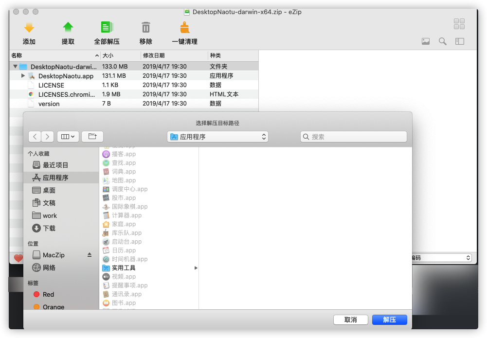
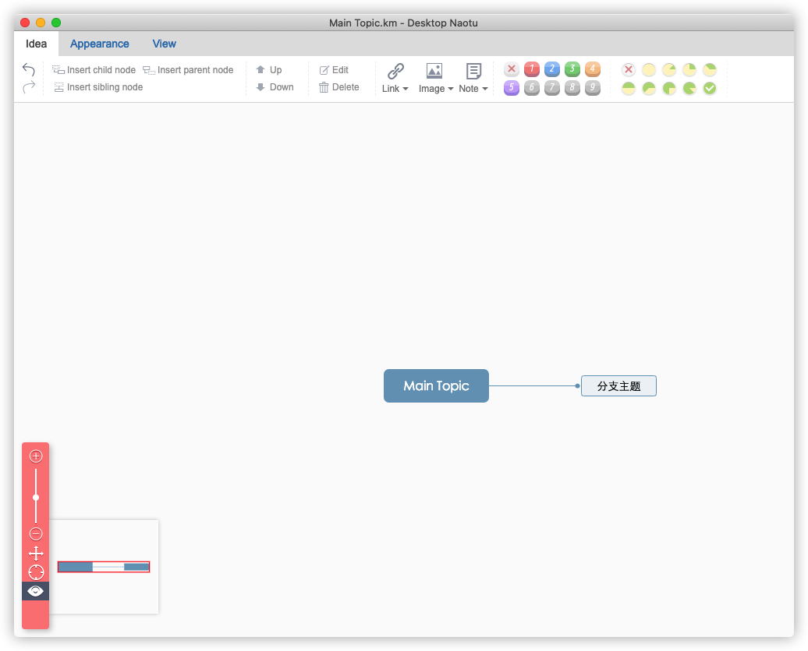

# 标题

本文作者：HelloGitHub-<strong>蔡文心</strong>

大家好！这里是 HelloGitHub 推出的[《讲解开源项目》](https://github.com/HelloGitHub-Team/Article)系列，今天给大家带来的一款基于 Electron 和 PHP 实现的**桌面工具**开源项目——**DesktopNaotu**（桌面版脑图）。

不知道各位小伙伴有没有发现，现在许多工作岗位与图表制作的接触越来越多，时不时给你来个需求，就像渣 * 在 PUA 你。市面上的多数图表制作软件要么收费，要么让充 VIP 。充个月卡，很有可能只用了1次。这不是浪费钱嘛！

如果你身边有这样的朋友，请善待 TA ，没事给 TA 点个赞

如果你没有，那你现在有了，很不幸我就是其中之一

好产品收费当然无可厚非，不过你可是 HG 的读者，而我们 HG 的背后是开源世界。DesktopNaotu 是一个开源项目，它也是一个完全免费的脑图制作工具。

## 一、介绍

DesktopNaotu 是基于百度脑图的本地化版本，能够帮助你在没有互联网环境的情况下，依然可以使用脑图工具。

> 官网：https://inaotu.org/

### 1.1 跨平台

DesktopNaotu 目前支持 MacOS 、Linux 和 Windows 7/10

### 1.2 功能

- 包含百度脑图的基本功能
- 支持本地 .km文件的操作
- 支持拖拽打开 .km文件
- 支持关联打开 .km文件
- 支持自动保存文件功能
- 支持导出多种格式文件
- 提供 **百度脑图** 文件的下载方式：https://github.com/NaoTu/DesktopNaotu/blob/master/doc/Help.md
- 提供 **ProcessOn** 思维导图的下载方式

## 二、安装

### 2.1 下载安装包

- 百度云 https://pan.baidu.com/s/1jHNBL7C
- Github https://github.com/NaoTu/DesktopNaotu/releases

### 2.2 解压

将DesktopNaotu-darwin-x64文件夹解压至应用程序目录

### 2.3 启动

> 注意：现在Mac版还没有中文菜单

## 三、技术栈

### 3.1 前端

- Electron ：使用了 Electron 实现跨平台应用开发
- Typescript

### 3.2 后端

- PHP

## 四、最后

本人学艺不精，对

